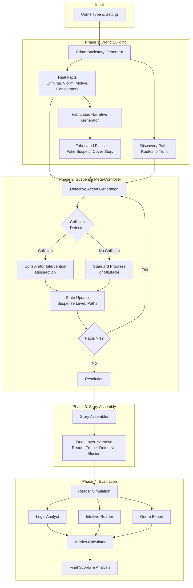

# Smokemirror Pipeline Diagram

## Pipeline Overview (Text Description)

```
┌─────────────────────────────────────────────────────────────────────────────┐
│                           STORY GENERATION PIPELINE                          │
└─────────────────────────────────────────────────────────────────────────────┘

                              ┌──────────────┐
                              │    Input     │
                              │ Crime Type,  │
                              │   Setting    │
                              └──────┬───────┘
                                     │
                                     ▼
                    ┌────────────────────────────────┐
                    │   Crime Backstory Generator    │
                    │  ┌──────────────────────────┐  │
                    │  │ • Real Criminal          │  │
                    │  │ • Victim & Motive        │  │
                    │  │ • Conspirators (2-4)     │  │
                    │  │ • Discovery Paths        │  │
                    │  └──────────────────────────┘  │
                    └────────────────┬───────────────┘
                                     │
                    ┌────────────────┴───────────────┐
                    │                                │
                    ▼                                ▼
        ┌───────────────────┐            ┌───────────────────┐
        │    Real Facts     │            │  Discovery Paths  │
        │  (Reader Layer)   │            │   (Truth Routes)  │
        └─────────┬─────────┘            └─────────┬─────────┘
                  │                                │
                  ▼                                │
    ┌─────────────────────────────┐               │
    │ Fabricated Narrative Gen.   │               │
    │ ┌─────────────────────────┐ │               │
    │ │ • Fake Suspect          │ │               │
    │ │ • Cover Story           │ │               │
    │ │ • Planted Evidence      │ │               │
    │ └─────────────────────────┘ │               │
    └──────────────┬──────────────┘               │
                   │                              │
                   ▼                              │
        ┌───────────────────┐                     │
        │ Fabricated Facts  │                     │
        │(Detective Layer)  │                     │
        └─────────┬─────────┘                     │
                  │                               │
                  └───────────────┬───────────────┘
                                  │
                                  ▼
┌─────────────────────────────────────────────────────────────────────────────┐
│                        SUSPENSE META-CONTROLLER                              │
│  ┌─────────────────────────────────────────────────────────────────────┐    │
│  │                        Iterative Generation Loop                     │    │
│  │                                                                      │    │
│  │   ┌──────────────┐    ┌──────────────────┐    ┌────────────────┐   │    │
│  │   │  Detective   │───▶│    Collision     │───▶│  Plot Point    │   │    │
│  │   │   Action     │    │    Detector      │    │   Generation   │   │    │
│  │   └──────────────┘    └────────┬─────────┘    └───────┬────────┘   │    │
│  │                                │                      │            │    │
│  │                    ┌───────────┴───────────┐          │            │    │
│  │                    ▼                       ▼          │            │    │
│  │           ┌────────────────┐    ┌─────────────────┐   │            │    │
│  │           │   Collision    │    │  No Collision   │   │            │    │
│  │           │   Detected     │    │  (Standard)     │   │            │    │
│  │           └───────┬────────┘    └────────┬────────┘   │            │    │
│  │                   │                      │            │            │    │
│  │                   ▼                      ▼            │            │    │
│  │         ┌──────────────────┐   ┌──────────────────┐   │            │    │
│  │         │   Conspirator    │   │    Obstacle /    │   │            │    │
│  │         │  Intervention    │   │    Progress      │   │            │    │
│  │         │  (Misdirection)  │   │                  │   │            │    │
│  │         └────────┬─────────┘   └────────┬─────────┘   │            │    │
│  │                  │                      │             │            │    │
│  │                  └──────────┬───────────┘             │            │    │
│  │                             ▼                         │            │    │
│  │                  ┌──────────────────────┐             │            │    │
│  │                  │    Update State      │◀────────────┘            │    │
│  │                  │  • Suspense Level    │                          │    │
│  │                  │  • Close/Open Paths  │                          │    │
│  │                  │  • Detective Knowledge│                          │    │
│  │                  └──────────┬───────────┘                          │    │
│  │                             │                                      │    │
│  │                    ┌────────┴────────┐                             │    │
│  │                    ▼                 ▼                             │    │
│  │            ┌─────────────┐   ┌─────────────┐                       │    │
│  │            │  Continue   │   │ Resolution  │                       │    │
│  │            │  (paths>1)  │   │ (paths≤1)   │                       │    │
│  │            └──────┬──────┘   └──────┬──────┘                       │    │
│  │                   │                 │                              │    │
│  │                   └────────┬────────┘                              │    │
│  └────────────────────────────┼─────────────────────────────────────────┘    │
└───────────────────────────────┼─────────────────────────────────────────────┘
                                │
                                ▼
                    ┌───────────────────────┐
                    │     Plot Points       │
                    │  (20-30 with suspense │
                    │   levels & metadata)  │
                    └───────────┬───────────┘
                                │
                                ▼
                    ┌───────────────────────┐
                    │    Story Assembler    │
                    │  ┌─────────────────┐  │
                    │  │ Dual-Layer      │  │
                    │  │ Narrative:      │  │
                    │  │ • Reader sees   │  │
                    │  │   truth         │  │
                    │  │ • Detective     │  │
                    │  │   sees illusion │  │
                    │  └─────────────────┘  │
                    └───────────┬───────────┘
                                │
                                ▼
                    ┌───────────────────────┐
                    │   Generated Story     │
                    │   (Markdown/Text)     │
                    └───────────┬───────────┘
                                │
                                ▼
┌─────────────────────────────────────────────────────────────────────────────┐
│                           READER SIMULATION                                  │
│  ┌─────────────────┐  ┌─────────────────┐  ┌─────────────────┐             │
│  │  Logic Analyst  │  │Intuitive Reader │  │  Genre Expert   │             │
│  │   (weight=1.5)  │  │   (weight=1.0)  │  │   (weight=1.2)  │             │
│  └────────┬────────┘  └────────┬────────┘  └────────┬────────┘             │
│           │                    │                    │                       │
│           └────────────────────┼────────────────────┘                       │
│                                ▼                                            │
│                    ┌───────────────────────┐                                │
│                    │     Evaluations       │                                │
│                    │  • Suspense Scores    │                                │
│                    │  • Criminal Guesses   │                                │
│                    │  • Inconsistencies    │                                │
│                    │  • Engagement         │                                │
│                    └───────────┬───────────┘                                │
└────────────────────────────────┼────────────────────────────────────────────┘
                                 │
                                 ▼
                    ┌───────────────────────┐
                    │   Metrics Calculator  │
                    │  • Suspense Curve     │
                    │  • Layer Leak Check   │
                    │  • Quality Flags      │
                    │  • Overall Score      │
                    └───────────────────────┘
```

## Mermaid Diagram (for online rendering)



## LaTeX TikZ Code (for ACL Paper)

```latex
\documentclass{article}
\usepackage{tikz}
\usetikzlibrary{shapes.geometric, arrows.meta, positioning, fit, backgrounds}

\begin{document}

\begin{figure*}[t]
\centering
\resizebox{\textwidth}{!}{
\begin{tikzpicture}[
    node distance=0.8cm and 1.2cm,
    box/.style={rectangle, draw, rounded corners, minimum width=2.5cm, minimum height=0.8cm, align=center, font=\small},
    phase/.style={rectangle, draw=blue!50, fill=blue!5, rounded corners, minimum width=3cm, font=\small\bfseries},
    decision/.style={diamond, draw, aspect=2, minimum width=1.5cm, font=\small},
    arrow/.style={-{Stealth[length=2mm]}, thick},
    dasharrow/.style={-{Stealth[length=2mm]}, thick, dashed},
]

% Phase 1: World Building
\node[phase] (phase1) {Phase 1: World Building};
\node[box, below=0.5cm of phase1] (backstory) {Crime Backstory\\Generator};
\node[box, below left=0.8cm and 0.5cm of backstory] (realfacts) {Real Facts\\(Reader Layer)};
\node[box, below right=0.8cm and 0.5cm of backstory] (paths) {Discovery\\Paths};
\node[box, below=0.8cm of realfacts] (fabgen) {Fabricated Narrative\\Generator};
\node[box, below=0.5cm of fabgen] (fabfacts) {Fabricated Facts\\(Detective Layer)};

% Phase 2: Suspense Controller
\node[phase, right=3cm of phase1] (phase2) {Phase 2: Suspense Meta-Controller};
\node[box, below=0.5cm of phase2] (detective) {Detective Action\\Generation};
\node[decision, below=0.6cm of detective] (collision) {Collision?};
\node[box, below left=0.8cm and 0.3cm of collision] (intervention) {Conspirator\\Intervention};
\node[box, below right=0.8cm and 0.3cm of collision] (standard) {Standard\\Progress};
\node[box, below=1.5cm of collision] (state) {State Update\\(Suspense, Paths)};
\node[decision, below=0.6cm of state] (continue) {Paths > 1?};
\node[box, below=0.6cm of continue] (resolution) {Resolution};

% Phase 3: Story Assembly
\node[phase, right=3cm of phase2] (phase3) {Phase 3: Story Assembly};
\node[box, below=0.5cm of phase3] (assembler) {Story Assembler};
\node[box, below=0.6cm of assembler] (story) {Dual-Layer\\Narrative};

% Phase 4: Evaluation
\node[phase, below=1cm of story] (phase4) {Phase 4: Reader Simulation};
\node[box, below left=0.5cm and 1cm of phase4] (logic) {Logic\\Analyst};
\node[box, below=0.5cm of phase4] (intuitive) {Intuitive\\Reader};
\node[box, below right=0.5cm and 1cm of phase4] (genre) {Genre\\Expert};
\node[box, below=1.2cm of intuitive] (metrics) {Metrics\\Calculator};
\node[box, below=0.5cm of metrics] (output) {Final Scores\\& Analysis};

% Arrows - Phase 1
\draw[arrow] (backstory) -- (realfacts);
\draw[arrow] (backstory) -- (paths);
\draw[arrow] (realfacts) -- (fabgen);
\draw[arrow] (fabgen) -- (fabfacts);

% Arrows - Phase 1 to Phase 2
\draw[arrow] (fabfacts.east) -- ++(1,0) |- (detective.west);
\draw[arrow] (paths.east) -- ++(0.5,0) |- (detective.west);

% Arrows - Phase 2
\draw[arrow] (detective) -- (collision);
\draw[arrow] (collision) -- node[left, font=\scriptsize] {Yes} (intervention);
\draw[arrow] (collision) -- node[right, font=\scriptsize] {No} (standard);
\draw[arrow] (intervention) |- (state);
\draw[arrow] (standard) |- (state);
\draw[arrow] (state) -- (continue);
\draw[arrow] (continue) -- node[right, font=\scriptsize] {No} (resolution);
\draw[arrow] (continue.west) -- ++(-0.8,0) |- node[left, font=\scriptsize, pos=0.25] {Yes} (detective.west);

% Arrows - Phase 2 to Phase 3
\draw[arrow] (resolution.east) -- ++(0.5,0) |- (assembler.west);

% Arrows - Phase 3
\draw[arrow] (assembler) -- (story);

% Arrows - Phase 3 to Phase 4
\draw[arrow] (story) -- (phase4);

% Arrows - Phase 4
\draw[arrow] (phase4) -- (logic);
\draw[arrow] (phase4) -- (intuitive);
\draw[arrow] (phase4) -- (genre);
\draw[arrow] (logic) |- (metrics);
\draw[arrow] (intuitive) -- (metrics);
\draw[arrow] (genre) |- (metrics);
\draw[arrow] (metrics) -- (output);

% Background boxes for phases
\begin{scope}[on background layer]
    \node[fit=(phase1)(backstory)(realfacts)(fabgen)(fabfacts)(paths),
          draw=blue!30, fill=blue!3, rounded corners, inner sep=0.3cm] {};
    \node[fit=(phase2)(detective)(collision)(intervention)(standard)(state)(continue)(resolution),
          draw=green!30, fill=green!3, rounded corners, inner sep=0.3cm] {};
    \node[fit=(phase3)(assembler)(story),
          draw=orange!30, fill=orange!3, rounded corners, inner sep=0.3cm] {};
    \node[fit=(phase4)(logic)(intuitive)(genre)(metrics)(output),
          draw=purple!30, fill=purple!3, rounded corners, inner sep=0.3cm] {};
\end{scope}

\end{tikzpicture}
}
\caption{Overview of the Smokemirror story generation pipeline. The system generates dual-layer mystery narratives where readers know the truth while the detective is systematically misled by conspirators.}
\label{fig:pipeline}
\end{figure*}

\end{document}
```

## Simplified Version for Paper (Horizontal Flow)

```latex
\begin{figure}[t]
\centering
\resizebox{\columnwidth}{!}{
\begin{tikzpicture}[
    node distance=0.6cm,
    box/.style={rectangle, draw, rounded corners, minimum width=1.8cm, minimum height=1.2cm, align=center, font=\scriptsize},
    arrow/.style={-{Stealth[length=2mm]}, thick},
]

% Main flow
\node[box, fill=blue!10] (input) {Input\\Setting};
\node[box, fill=blue!20, right=of input] (backstory) {Backstory\\Generator};
\node[box, fill=green!20, right=of backstory] (controller) {Suspense\\Controller};
\node[box, fill=orange!20, right=of controller] (assembler) {Story\\Assembler};
\node[box, fill=purple!20, right=of assembler] (reader) {Reader\\Simulation};
\node[box, fill=gray!20, right=of reader] (output) {Evaluation\\Metrics};

% Arrows
\draw[arrow] (input) -- (backstory);
\draw[arrow] (backstory) -- (controller);
\draw[arrow] (controller) -- (assembler);
\draw[arrow] (assembler) -- (reader);
\draw[arrow] (reader) -- (output);

% Labels below
\node[below=0.3cm of backstory, font=\tiny, align=center] {Real Facts +\\Fabricated Facts};
\node[below=0.3cm of controller, font=\tiny, align=center] {Plot Points\\(Collision Detection)};
\node[below=0.3cm of assembler, font=\tiny, align=center] {Dual-Layer\\Narrative};
\node[below=0.3cm of reader, font=\tiny, align=center] {3 Reader\\Perspectives};

\end{tikzpicture}
}
\caption{Smokemirror pipeline overview.}
\end{figure}
```

## Key Components Summary

| Component | Input | Output | Key Function |
|-----------|-------|--------|--------------|
| Crime Backstory Generator | Crime type, setting | Real facts, Discovery paths | Creates ground truth |
| Fabricated Narrative Generator | Real facts | Fake suspect, Cover story | Creates deception layer |
| Suspense Meta-Controller | Both fact layers, Paths | 20-30 Plot points | Manages dual narrative with collision detection |
| Story Assembler | Plot points, Facts | Prose narrative | Weaves dual-layer story |
| Reader Simulation | Generated story | Evaluations | Multi-perspective assessment |
| Metrics Calculator | All outputs | Scores, Analysis | Quality measurement |
